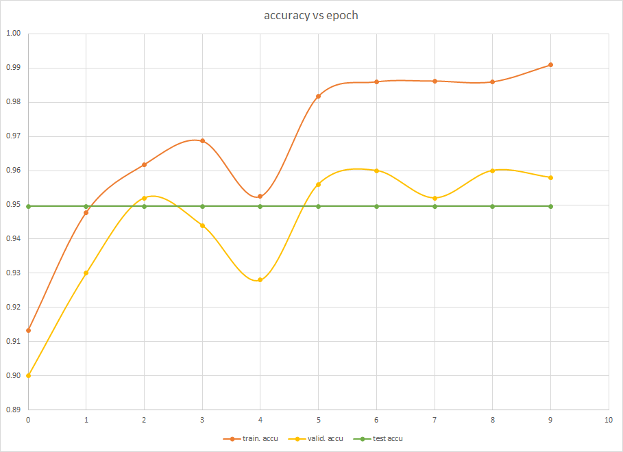

# CPPND Capstone Project
# Convolutional Neural Network for Classification of MNIST Handwritten Digit Database

This repo contains code for Capstone Project compiled as part of the [Udacity C++ Nanodegree Program](https://www.udacity.com/course/c-plus-plus-nanodegree--nd213).

#### Goal
In this project, a Convolutional Neural Network (CNN) has been designed and built from scratch in C++, that attempts to learn and classify the [MNIST Handwritten Digit Database](http://yann.lecun.com/exdb/mnist/). The database contains various bitmaps of the handwritten versions of the 10 digits/labels: *'0', '1', '2', '3', '4', '5', '6', '7', '8', '9'*.

The actual architecture of the Neural Network is based on the ["LeNet-5" publication](http://yann.lecun.com/exdb/publis/pdf/lecun-01a.pdf). More information can be found [here](http://yann.lecun.com/exdb/lenet/) and [here](https://engmrk.com/lenet-5-a-classic-cnn-architecture/). 

The structure and design of the source code for this project aspires to leverage key aspects of C++ programming language and showcase the concepts learned as part of the Nanodegree program. The project has been formulated to satisfy the project rubric specified in the Nanodegree program. The rubric is listed below.
#### Input
The input data for this application is the MNIST database, which was constructed using handwritten digits in black and white. More details can be found [here](http://yann.lecun.com/exdb/mnist/).
#### Performance
The efficacy of the CNN model is determined by the following key performance indicators:
* accuracy - captures if a digit/label has been classified correctly during training/validation/testing process; i.e., *is the classification wrong?*.
* loss - specifies the error encountered between classification and the actual label of the final output layer; i.e., *how wrong is the classification?*.

#### Code Directory Structure
* */inc* - C++ header files (**.hpp*)
* */src* - C++ source files (**.cpp*)
* */data* - training and test data files (**-ubyte*)

## Dependencies for Running Locally
* cmake >= 3.11
  * All OSes: [click here for installation instructions](https://cmake.org/install/)
* make >= 4.1 (Linux, Mac), 3.81 (Windows)
  * Linux: make is installed by default on most Linux distros
  * Mac: [install Xcode command line tools to get make](https://developer.apple.com/xcode/features/)
  * Windows: [Click here for installation instructions](http://gnuwin32.sourceforge.net/packages/make.htm)
* gcc/g++ >= 5.4
  * Linux: gcc / g++ is installed by default on most Linux distros
  * Mac: same deal as make - [install Xcode command line tools](https://developer.apple.com/xcode/features/)
  * Windows: recommend using [MinGW](http://www.mingw.org/)
install v3.0 or greater.

## Build and Execute Instructions

1. Clone this repo.
2. Make a build directory in the top level directory: `mkdir build && cd build`
3. Compile: `cmake .. && make`
4. Copy data into build folder: `cp ../data/*ubyte .`
4. Run it: `./capstone_cnn`.

## Project Rubric

#### 1. README

| CRITERIA                                                     |           STATUS |
| ------------------------------------------------------------ | ---------------: |
| A README with instructions is included with the project      | DONE (README.md) |
| The README indicates which project is chosen.                | DONE (README.md) |
| The README includes information about each rubric point addressed. | DONE (README.md) |

#### 2. Compiling and Testing

| CRITERIA                             | STATUS |
| ------------------------------------ | -----: |
| The submission must compile and run. |   DONE |

#### 3. Loops, Functions, I/O

| CRITERIA                                                     |                            STATUS |
| ------------------------------------------------------------ | --------------------------------: |
| The project demonstrates an understanding of C++ functions and control structures. |  DONE (/src/dataset.cpp #78, #80) |
| The project reads data from a file and process the data, or the program writes data to a file. | DONE (/src/dataset.cpp #64, #172) |
| The project accepts user input and processes the input.      |                                NO |

#### 4. Object Oriented Programming

| CRITERIA                                                     |                 STATUS |
| ------------------------------------------------------------ | ---------------------: |
| The project uses Object Oriented Programming techniques.     |  DONE (/inc/layer.hpp) |
| Classes use appropriate access specifiers for class members. |  DONE (/inc/layer.hpp) |
| Class constructors utilize member initialization lists.      |  DONE (/inc/layer.hpp) |
| Classes abstract implementation details from their interfaces. |  DONE (/inc/layer.hpp) |
| Classes encapsulate behavior.                                |  DONE (/inc/layer.hpp) |
| Classes follow an appropriate inheritance hierarchy.         |  DONE (/inc/layer.hpp) |
| Overloaded functions allow the same function to operate on different parameters. | DONE (/inc/matrix.hpp) |
| Derived class functions override virtual base class functions. |  DONE (/inc/layer.hpp) |
| Templates generalize functions in the project.               |                     NO |

#### 4. Memory Management

| CRITERIA                                                     |                 STATUS |
| ------------------------------------------------------------ | ---------------------: |
| The project makes use of references in function declarations. | DONE (/inc/matrix.hpp) |
| The project uses destructors appropriately.                  | DONE (/inc/matrix.hpp) |
| The project uses scope / Resource Acquisition Is Initialization (RAII) where appropriate. | DONE (/inc/matrix.hpp) |
| The project follows the Rule of 5.                           | DONE (/inc/matrix.hpp) |
| The project uses move semantics to move data, instead of copying it, where possible. | DONE (/src/matrix.cpp) |
| The project uses smart pointers instead of raw pointers.     | DONE (/inc/matrix.hpp) |

#### 4. Concurrency

| CRITERIA                                     |                  STATUS |
| -------------------------------------------- | ----------------------: |
| The project uses multithreading.             | DONE (/src/dataset.cpp) |
| A promise and future is used in the project. |                      NO |
| A mutex or lock is used in the project.      | DONE (/inc/defines.cpp) |
| A condition variable is used in the project. | DONE (/inc/defines.cpp) |

## CNN Architecture

The system is modeled after LeNet-5 architecture proposed [here](http://yann.lecun.com/exdb/publis/pdf/lecun-01a.pdf). Input is a single channel 1x28x28 image, while output is a one-hot vector of possible set of labels (10x1x1).

| Index | Layer                                                        | Input   | Output  |
| ----- | ------------------------------------------------------------ | ------- | ------- |
| 0     | First Convolution Layer (6 features - 5x5 kernel - 1 stride) | 1x28x28 | 6x24x24 |
| 1     | First RELU Layer                                             | 6x24x24 | 6x24x24 |
| 2     | First Max Pooling Layer (6 features - 2x2 pool - 2 stride)   | 6x24x24 | 6x12x12 |
| 3     | Second Convolution Layer (16 features - 5x5 kernel - 1 stride) | 6x12x12 | 16x8x8  |
| 4     | Second RELU Layer                                            | 16x8x8  | 16x8x8  |
| 5     | Second Max Pooling Layer (16 features - 2x2 pool - 2 stride) | 16x8x8  | 16x4x4  |
| 6     | Dense Fully Connected Layer                                  | 16x4x4  | 10x1x1  |
| 7     | Softmax Activation Layer                                     | 10x1x1  | 10x1x1  |
| 8     | Cross-entropy Loss Layer                                     | 10x1x1  | 10x1x1  |

##### Hyper-parameters:

| Parameter                                  | Type/Value                    | Comment(s)                                                   |
| ------------------------------------------ | ----------------------------- | ------------------------------------------------------------ |
| Training Data Size (incl. Validation Data) | 5000                          | 60000 maximum possible.                                      |
| Testing Data Size                          | 5000                          | 10000 maximum possible.                                      |
| Epochs                                     | 5                             |                                                              |
| Batch Size                                 | 10                            |                                                              |
| Image Pixel Scale                          | 255.0                         |                                                              |
| Learning Rate                              | 0.001                         | 0.05 was causing the CNN to diverge.                         |
| FC Layer Gain                              | 1000                          | Output scaled down to avoid issues in Softmax layer.         |
| Train vs Validation Split                  | 0.9                           | = 4500 training data + 500 validation data.                  |
| Normalization                              | Overall                       | All of training data set was used to compute *mu* and *sigma*. |
| Weights/filters initialization             | Truncated Normal Distribution |                                                              |
| Bias initialization                        | Zeros                         |                                                              |
| Weights and bias update                    | After every batch             |                                                              |
| Randomize training data                    | Shuffle every epoch           |                                                              |

## CNN Training, Validation and Test Results

The following are the partial results of a single run of the CNN with the above parameters.

| epoch | train. loss | train. accuracy | valid. loss | valid. accuracy | test loss | test accuracy |
| :-------: | :---------------: | :----------: | :----------: | :----------: | :----------: | :----------: |
|     0     |       0.30        |     0.91     |   0.35   |     0.90     |     0.16     |     0.95     |
|     1     |       0.19        |     0.95     |   0.24   |     0.93     |     0.16     |     0.95     |
|     2     |       0.14        |     0.96     |   0.20   |     0.95     |     0.16     |     0.95     |
|     3     |       0.11        |     0.97     |   0.18   |     0.94     |     0.16     |     0.95     |
|     4     |       0.15        |     0.95     |   0.25   |     0.93     |     0.16     |     0.95     |
|     5     |       0.07        |     0.98     |   0.15   |     0.96     |     0.16     |     0.95     |
| 6 | 0.06 | 0.99 | 0.13 | 0.96 | 0.16 | 0.95 |
| 7 | 0.05 | 0.99 | 0.14 | 0.95 | 0.16 | 0.95 |
| 8 | 0.05 | 0.99 | 0.14 | 0.96 | 0.16 | 0.95 |
| 9 | 0.04 | 0.99 | 0.13 | 0.96 | 0.16 | 0.95 |

The following table captures how accurately the CNN classifies a given label during training (the incidence probability of the label in the training data is also captured):

| label | incidence | train accuracy | test accuracy |
| :---: | :-------: | :------------: | :-----------: |
|   0   |   0.10    |      0.97      |     0.99      |
|   1   |   0.11    |      0.97      |     0.98      |
|   2   |   0.10    |      0.93      |     0.95      |
|   3   |   0.10    |      0.94      |     0.94      |
|   4   |   0.11    |      0.95      |     0.92      |
|   5   |   0.09    |      0.94      |     0.95      |
|   6   |   0.10    |      0.96      |     0.95      |
|   7   |   0.11    |      0.94      |     0.95      |
|   8   |   0.09    |      0.92      |     0.90      |
|   9   |   0.10    |      0.91      |     0.95      |

The following graph captures how loss and accuracy settle over the course of the training.

